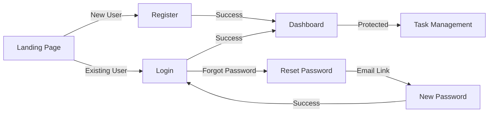

<div align="center">
  
# 🎨 Bare Minimum Planner - Frontend

### A Modern, Minimalist Task Management Interface


<p align="center">
  <a href="#-features">Features</a> •
  <a href="#-tech-stack">Tech Stack</a> •
  <a href="#-getting-started">Getting Started</a> •
  <a href="#-project-structure">Project Structure</a> •
  <a href="#-available-scripts">Scripts</a>
</p>

</div>

---

## ✨ Features

<table>
<tr>
<td width="50%" valign="top">

### 🔐 Authentication

- ✅ User registration with validation
- ✅ Secure login with JWT tokens
- ✅ Password reset functionality
- ✅ Protected route guards
- ✅ Persistent authentication state

### 📱 Responsive Design

- ✅ Mobile-first approach
- ✅ Tablet & desktop optimized
- ✅ Smooth transitions
- ✅ Modern UI components

</td>
<td width="50%" valign="top">

### 📝 Task Management

- ✅ Create, read, update, delete tasks
- ✅ Real-time task updates
- ✅ Task completion toggle
- ✅ Task filtering & organization
- ✅ Intuitive dashboard interface

### 🎨 User Experience

- ✅ Toast notifications
- ✅ Loading states & spinners
- ✅ Form validation feedback
- ✅ Framer Motion animations
- ✅ Clean, minimalist design

</td>
</tr>
</table>

---

## 🛠️ Tech Stack

<table>
<tr>
<td width="33%" align="center">

### Core Framework


Building UI with the latest React features including hooks, context, and modern patterns.

</td>
<td width="33%" align="center">

### Build Tool


Lightning-fast HMR and optimized production builds.

</td>
<td width="33%" align="center">

### Styling


Utility-first CSS framework for rapid UI development.

</td>
</tr>
</table>

### 📦 Key Dependencies

| Package                 | Version | Purpose             |
| ----------------------- | ------- | ------------------- |
| **react**               | 19.2.0  | UI library          |
| **react-router-dom**    | 7.13.0  | Client-side routing |
| **zustand**             | 5.0.11  | State management    |
| **axios**               | 1.13.5  | HTTP client         |
| **framer-motion**       | 12.34.0 | Animation library   |
| **react-hot-toast**     | 2.6.0   | Toast notifications |
| **react-icons**         | 5.5.0   | Icon library        |
| **@fontsource/poppins** | 5.2.7   | Custom font         |

---

## 🚀 Getting Started

### Prerequisites

Before you begin, ensure you have the following installed:

```bash
Node.js >= 18.x
npm >= 9.x (or yarn)
```

### Installation

1. **Clone the repository**

```bash
git clone https://github.com/JomsCode21/Bare-Minimum-Planner-Front-End.git
cd Bare-Minimum-Planner-Front-End
```

2. **Install dependencies**

```bash
npm install
```

3. **Configure environment** (if needed)

The frontend is pre-configured to proxy API requests to `http://localhost:5000`.

To change the backend URL, update [vite.config.ts](vite.config.ts):

```typescript
server: {
  proxy: {
    "/api": {
      target: "http://your-backend-url:port",
      changeOrigin: true,
    },
  },
}
```

4. **Start the development server**

```bash
npm run dev
```

The application will be available at `http://localhost:5173` 🚀

---

## 📁 Project Structure

```
frontend/
├── public/                    # Static assets
├── src/
│   ├── api/                  # API service layer
│   │   ├── auth.ts           # Authentication API calls
│   │   └── tasks.ts          # Task management API calls
│   │
│   ├── assets/               # Images, icons, etc.
│   │
│   ├── axios/                # Axios configuration
│   │   └── axios-instance.ts # Axios instance with interceptors
│   │
│   ├── components/           # React components
│   │   ├── dashboard/        # Dashboard-specific components
│   │   │   ├── AddTaskModal.tsx
│   │   │   ├── ButtonNav.tsx
│   │   │   ├── DashboardCard.tsx
│   │   │   ├── DeleteTaskModal.tsx
│   │   │   ├── DeletesuccessModal.tsx
│   │   │   ├── EditTaskModal.tsx
│   │   │   └── ViewTaskModal.tsx
│   │   │
│   │   ├── forgotpassword/   # Password reset components
│   │   │   ├── ForgotPasswordCard.tsx
│   │   │   └── ResetPasswordCard.tsx
│   │   │
│   │   ├── login/            # Login components
│   │   │   └── Logincard.tsx
│   │   │
│   │   ├── register/         # Registration components
│   │   │   ├── RegisterCard.tsx
│   │   │   └── TermsModal.tsx
│   │   │
│   │   ├── routes/           # Route protection
│   │   │   ├── ProtectedRoutes.tsx
│   │   │   └── PublicRoutes.tsx
│   │   │
│   │   └── ui/               # Reusable UI components
│   │       ├── Buttons.tsx
│   │       ├── InputField.tsx
│   │       └── UniversalButton.tsx
│   │
│   ├── pages/                # Page components (routes)
│   │   ├── dashboard/
│   │   │   └── Dashboard.tsx
│   │   ├── forgotpassword/
│   │   │   ├── ForgotPasswordPage.tsx
│   │   │   └── ResetPasswordPage.tsx
│   │   ├── login/
│   │   │   └── LoginPage.tsx
│   │   ├── register/
│   │   │   └── RegisterPage.tsx
│   │   └── LandingPage.tsx
│   │
│   ├── store/                # Zustand state management
│   │   ├── authStore.ts      # Authentication state
│   │   └── taskStore.ts      # Task management state
│   │
│   ├── types/                # TypeScript type definitions
│   │   ├── auth.ts
│   │   ├── dashboard.ts
│   │   ├── forgotpassword.ts
│   │   ├── task.ts
│   │   ├── terms&condition.ts
│   │   └── ui.ts
│   │
│   ├── utils/                # Utility functions
│   │
│   ├── App.tsx               # Main application component
│   ├── main.tsx              # Application entry point
│   └── index.css             # Global styles
│
├── .eslintrc.js              # ESLint configuration
├── tsconfig.json             # TypeScript configuration
├── tsconfig.app.json         # App-specific TS config
├── tsconfig.node.json        # Node-specific TS config
├── vite.config.ts            # Vite configuration
├── package.json              # Dependencies and scripts
└── README.md                 # This file
```

---

## 🎯 Key Features Explained

### 🔐 Authentication Flow



### 🗂️ State Management (Zustand)

The application uses **Zustand** for simple and efficient state management:

#### Auth Store (`store/authStore.ts`)

- Manages user authentication state
- Handles login/logout
- Persists authentication across page refreshes
- Provides auth status to components

#### Task Store (`store/taskStore.ts`)

- Manages task list
- CRUD operations for tasks
- Loading states
- Error handling

### 🛣️ Routing Structure

| Route             | Component            | Protection     | Description               |
| ----------------- | -------------------- | -------------- | ------------------------- |
| `/`               | `LandingPage`        | ❌ Public      | Welcome page              |
| `/login`          | `LoginPage`          | 🔓 Public only | User login                |
| `/register`       | `RegisterPage`       | 🔓 Public only | User registration         |
| `/forgotpassword` | `ForgotPasswordPage` | 🔓 Public only | Request password reset    |
| `/resetpassword`  | `ResetPasswordPage`  | 🔓 Public only | Reset password with token |
| `/dashboard`      | `Dashboard`          | 🔒 Protected   | Main task dashboard       |

**Route Guards:**

- `PublicRoutes` - Redirects authenticated users to dashboard
- `ProtectedRoutes` - Redirects unauthenticated users to login

---

## 📝 Available Scripts

### Development

| Command           | Description                                                            |
| ----------------- | ---------------------------------------------------------------------- |
| `npm run dev`     | 🔥 Start development server with hot reload at `http://localhost:5173` |
| `npm run build`   | 🏗️ Build for production (TypeScript check + Vite build)                |
| `npm run preview` | 👀 Preview production build locally                                    |
| `npm run lint`    | ✨ Run ESLint to check code quality                                    |

### Script Details

```bash
# Start development server
npm run dev
# Features:
# - Hot Module Replacement (HMR)
# - Fast refresh
# - Source maps
# - Development optimizations

# Build for production
npm run build
# Steps:
# 1. TypeScript compilation check
# 2. Vite production build
# 3. Asset optimization
# 4. Code minification

# Preview production build
npm run preview
# Test production build locally before deployment

# Lint code
npm run lint
# Checks for:
# - Code quality issues
# - Unused variables
# - React best practices
# - TypeScript errors
```

---

## 🎨 Styling Approach

### Tailwind CSS + Custom Configuration

The project uses **Tailwind CSS v4** with the Vite plugin for optimal performance.

**Key Features:**

- 🎯 Utility-first approach
- 📱 Responsive design utilities
- 🎨 Custom color palette
- 🔤 Poppins font family
- ⚡ JIT (Just-In-Time) compilation

### Component Styling Pattern

```tsx
// Example: Button component with Tailwind
<button
  className="px-4 py-2 bg-blue-500 hover:bg-blue-600 
                   text-white rounded-lg transition-colors 
                   duration-200 ease-in-out"
>
  Click Me
</button>
```

---

## 🔌 API Integration

### Axios Configuration

The application uses a configured Axios instance with:

- **Base URL**: Automatically proxied through Vite
- **Credentials**: Included for cookie-based auth
- **Interceptors**: Handle auth tokens and errors
- **Type Safety**: Full TypeScript support

### API Services

#### Authentication (`api/auth.ts`)

```typescript
-login(email, password) -
  register(userData) -
  logout() -
  checkAuth() -
  forgotPassword(email) -
  resetPassword(token, newPassword);
```

#### Tasks (`api/tasks.ts`)

```typescript
-fetchTasks() -
  addTask(title, description) -
  updateTask(id, updates) -
  deleteTask(id) -
  toggleTaskCompletion(id);
```

---

## 🎭 Animation & Transitions

### Framer Motion Integration

Smooth, performant animations using **Framer Motion**:

- Page transitions
- Modal animations
- List item animations
- Hover effects
- Loading states

### Toast Notifications

**React Hot Toast** provides:

- Success messages
- Error alerts
- Loading indicators
- Custom styling
- Auto-dismiss

---

## 🧪 Code Quality

### TypeScript Configuration

The project uses strict TypeScript settings for maximum type safety:

```json
{
  "compilerOptions": {
    "strict": true,
    "noImplicitAny": true,
    "strictNullChecks": true
  }
}
```

### ESLint Setup

Configured with:

- React-specific rules
- React Hooks rules
- TypeScript ESLint
- React Refresh plugin

---

## 🚀 Deployment

### Build for Production

```bash
# Create production build
npm run build

# Output will be in: dist/
```

### Deployment Options

<table>
<tr>
<td align="center">

### Vercel

[](https://vercel.com/new)

</td>
<td align="center">

### Netlify

[](https://app.netlify.com/start)

</td>
</tr>
</table>

### Environment Variables

If deploying, ensure your backend URL is properly configured:

```bash
# .env (for non-Vite deployments)
VITE_API_URL=https://your-backend-api.com
```

---

## 🐛 Troubleshooting

<details>
<summary><strong>Development server won't start</strong></summary>

```bash
# Clear node_modules and reinstall
rm -rf node_modules package-lock.json
npm install

# Check if port 5173 is available
netstat -ano | findstr :5173
```

</details>

<details>
<summary><strong>API requests failing</strong></summary>

1. Ensure backend is running on `http://localhost:5000`
2. Check proxy configuration in `vite.config.ts`
3. Verify CORS settings in backend
4. Check browser console for errors
</details>

<details>
<summary><strong>TypeScript errors</strong></summary>

```bash
# Run type checking
npm run build

# Check specific file
npx tsc --noEmit
```

</details>

<details>
<summary><strong>Styling not working</strong></summary>

1. Ensure Tailwind CSS is properly configured
2. Check if `index.css` is imported in `main.tsx`
3. Clear browser cache
4. Restart dev server
</details>

---

## 📚 Learning Resources

### Documentation

- 📘 [React Documentation](https://react.dev/)
- ⚡ [Vite Guide](https://vitejs.dev/guide/)
- 🎨 [Tailwind CSS Docs](https://tailwindcss.com/docs)
- 🐻 [Zustand Documentation](https://github.com/pmndrs/zustand)
- 🎭 [Framer Motion](https://www.framer.com/motion/)

---

## 🤝 Contributing

Contributions are welcome! Here's how you can help:

1. 🍴 Fork the repository
2. 🌿 Create a feature branch
   ```bash
   git checkout -b feature/amazing-feature
   ```
3. ✍️ Commit your changes
   ```bash
   git commit -m 'Add some amazing feature'
   ```
4. 📤 Push to the branch
   ```bash
   git push origin feature/amazing-feature
   ```
5. 🔃 Open a Pull Request

### Development Guidelines

- Follow existing code style
- Write meaningful commit messages
- Add comments for complex logic
- Update documentation as needed
- Test thoroughly before submitting

---

## 📄 License

This project is licensed under the **ISC License**.

---

## 👥 Maintainers

<table>
<tr>
<td align="center">
<a href="https://github.com/JomsCode21">

<br />
<sub><b>JomsCode21</b></sub>
</a>
<br />
💻 🎨 📖
</td>
</tr>
</table>

---

## 🙏 Acknowledgments

- 💙 **React Team** - For the incredible framework
- ⚡ **Vite Team** - For the blazing-fast tooling
- 🎨 **Tailwind Labs** - For the amazing CSS framework
- 🐻 **Zustand Community** - For simple state management
- 🎭 **Framer** - For beautiful animations

---

## 🔗 Related Links

- 🔧 [Backend Repository](https://github.com/JomsCode21/Bare-Minimum-Planner-Back-End)
- 📝 [Project Documentation](https://github.com/JomsCode21/Bare-Minimum-Planner-Back-End/wiki)
- 🐛 [Report Issues](https://github.com/JomsCode21/Bare-Minimum-Planner-Front-End/issues)
- 💬 [Discussions](https://github.com/JomsCode21/Bare-Minimum-Planner-Front-End/discussions)

---

<div align="center">

### ⭐ Star this repo if you find it helpful!

**Made with ❤️ and ☕ by the Bare Minimum Planner Team**

[⬆ Back to Top](#-bare-minimum-planner---frontend)

</div>
